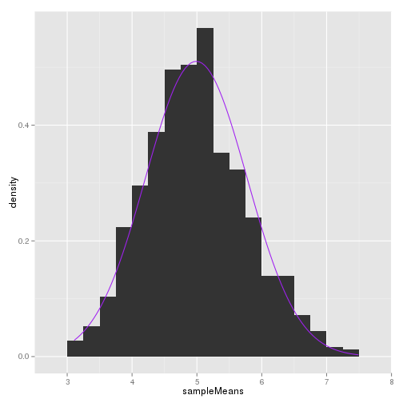

# Introduction

This project compares the exponential distribution to the Central Limit Theorum.

We use `rexp(n, lambda)` to simulate the distribution, where `lambda =
0.2` and the mean of the distribution is `1/lambda`. We run 1000
simulations of 40 samples.

In the investigation, we will address the following questions:

1. Show the sample mean and compare it to the theoretical mean of the distribution.
2. Show how variable the sample is (via variance) and compare it to the theoretical variance of the distribution.
3. Show that the distribution is approximately normal.

## Setup


We begin by setting variables and creating a data frame of 1000
simulations with 40 samples from the exponential distribution, `rexp`.


```r
set.seed(1)

lambda = 0.2
samples <- NULL

for (i in 1 : 1000) samples = rbind(samples, rexp(40, rate = lambda))
str(samples)
```

```
##  num [1:1000, 1:40] 3.78 5.4 1.93 1.18 7.48 ...
```

## Comparing the Sample Mean to the Theoretical Mean

### Sample Mean:

Here we generate the mean for each of the 1000 rows in the data frame
and then the mean of all the means.


```r
sampleMeans <- apply(samples,FUN = mean, MARGIN=1)
mean(sampleMeans)
```

```
## [1] 4.990025
```

### Theoretical Mean:

The theoretical mean is given by:

$1 / lambda$ =


```r
1/lambda
```

```
## [1] 5
```

Here we see that the sample mean is roughly centered at the
theoretical mean, just as the Central Limit Theorum predicts.

## Comparing the Sample Variance to the Theoretical Variance

### Theoretical Variance

The theoretical variance of the distribution is $\frac{(1 / \lambda)^2}{40}$:


```r
(1/lambda)^2/40
```

```
## [1] 0.625
```

### Sample Variance

Calculating the variance of the sample means:


```r
var(sampleMeans)
```

```
## [1] 0.6111165
```

Here we see that the theoretical sample mean and the actual sample
mean are also close.

## Distribution of the Sample


```r
g <- ggplot(as.data.frame(sampleMeans), aes(x = sampleMeans))
g + geom_histogram(binwidth=0.25, aes(y=..density..), position = "stack") +
    stat_function(fun = dnorm, color = 'purple',
                  args = list(mean = mean(sampleMeans), sd = sd(sampleMeans)))
```

 

Here we see that the distribution is approximately normal about the
mean, 5.

## Conclusion

Based on the work above, we see that the sample mean approximates the
theoretical mean, the variance of the sample mean approximates the
theoretical variance of the sampling distribution and that the sample
mean is approximately normally distributed.
