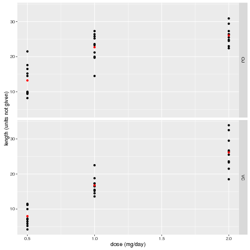

# Analysis of the ToothGrowth Data Setup

## Introduction and Setup

The following analysis examines tooth growth data in guinea pigs. It
examines the effect of two supplements, orange juice (`OJ`) and
ascorbic acid (`VC`) on tooth growth and does this at 3 dose levels,
0.5, 1.0 and 2.0 mg/day.


```r
data(ToothGrowth)
```

## Summary of Data

We start by taking a look at the original data.


```r
str(ToothGrowth)
```

```
## 'data.frame':	60 obs. of  3 variables:
##  $ len : num  4.2 11.5 7.3 5.8 6.4 10 11.2 11.2 5.2 7 ...
##  $ supp: Factor w/ 2 levels "OJ","VC": 2 2 2 2 2 2 2 2 2 2 ...
##  $ dose: num  0.5 0.5 0.5 0.5 0.5 0.5 0.5 0.5 0.5 0.5 ...
```

Here we see that the `dose` variable is not a factor variable. Since
we'll be categorizing the data based on `dose`, it's better to convert
this column to a factor column.


```r
tg <- ToothGrowth
tg$dose <- as.factor(tg$dose)
```

Summarizing the data, we see in the following chart, that for the
smaller dosages, `OJ` seems to perform better than `VC`, whereas for
the largest dosage they seem to perform about equally. The red dots
are the averages of the black dots for each given dose.


```r
g <- ggplot(tg, aes(dose, len))
b <- ddply(tg, .(supp, dose), summarize, mean = mean(len))
g + geom_point() + geom_point(aes(x=dose, y=mean), data = b, color = 'red') + facet_grid(supp ~ .)
```

 

Furthermore we would like to know if `OJ` is in general a better
supplement than `VC`, so we divide the data into two corresponding
data sets.


```r
vc <- tg[tg$supp == "VC", c(1,3)]
oj <- tg[tg$supp == "OJ", c(1,3)]

summary(vc)
```

```
##       len         dose   
##  Min.   : 4.20   0.5:10  
##  1st Qu.:11.20   1  :10  
##  Median :16.50   2  :10  
##  Mean   :16.96           
##  3rd Qu.:23.10           
##  Max.   :33.90
```

```r
summary(oj)
```

```
##       len         dose   
##  Min.   : 8.20   0.5:10  
##  1st Qu.:15.53   1  :10  
##  Median :22.70   2  :10  
##  Mean   :20.66           
##  3rd Qu.:25.73           
##  Max.   :30.90
```

We see that the mean `len`th for diets supplemented with `OJ` is
larger than that of `VC`, but does that mean that we can really be
confident that `OJ` is a better growth supplement than `VC`?

## Analysis

Based on the information above, we would like to know if `OJ` is the
better growth supplement for guinea pigs, as well as *at what* levels
`OJ` is a better growth supplement.

We will use _t-intervals_ for our tests.

### Confidence interval of the difference between `OJ` and `VC` **in general**

\( H_0 = \) No, `OJ` does not perform better than `VC` as a supplement

\( H_A = \) Yes, `OJ` does perform better than `VC` as a supplement


```r
t.test(oj$len, vc$len, paired = FALSE, var.equal = TRUE)$conf
```

```
## [1] -0.1670064  7.5670064
## attr(,"conf.level")
## [1] 0.95
```

### Confidence interval of the difference between `OJ` and `VC` **At different dosage levels**

Confidence interval of the difference between `OJ` and `VC` **at 0.5 mg/day**

\( H_{0_{0.5}} = \) `OJ` performs better than `VC` at a 0.5 dosage

\( H_{A_{0.5}} = \) `OJ` does not perform better than `VC` at a 0.5 dosage


```r
t.test(oj[oj$dose == 0.5,]$len, vc[vc$dose == 0.5,]$len, paired = FALSE, var.equal = TRUE)$conf
```

```
## [1] 1.770262 8.729738
## attr(,"conf.level")
## [1] 0.95
```

Confidence interval of the difference between `OJ` and `VC` **at 1 mg/day**

\( H_{0_{1}} = \) `OJ` performs better than `VC` at a 1 dosage

\( H_{A_{1}} = \) `OJ` does not perform better than `VC` at a 1 dosage


```r
t.test(oj[oj$dose == 1,]$len, vc[vc$dose == 1,]$len, paired = FALSE, var.equal = TRUE)$conf
```

```
## [1] 2.840692 9.019308
## attr(,"conf.level")
## [1] 0.95
```

Confidence interval of the difference between `OJ` and `VC` **at 2 mg/day**

\( H_{0_{2}} = \) `OJ` performs better than `VC` at a 2 dosage

\( H_{A_{2}} = \) `OJ` does not perform better than `VC` at a 2 dosage


```r
t.test(oj[oj$dose == 2,]$len, vc[vc$dose == 2,]$len, paired = FALSE, var.equal = TRUE)$conf
```

```
## [1] -3.722999  3.562999
## attr(,"conf.level")
## [1] 0.95
```

## Conclusion

As the above calculations indicate, `OJ` cannot be **generally**
considered a better growth supplement than `VC` because the 95%
confidence interval includes zero growth (although, just barely: -0.17
7.57).

The confidence intervals for the various dosages indicate that for
small dosages (0.5 and 1.0) `OJ` is a better growth supplement because
their 95% confidence intervals are all above 0 (1.77 - 8.73 and 2.84 -
9.02 for 0.5 mg/day and 1.0 mg/day, respectively), while the dosage of
2.0 indicates that both supplements are equally adequate.

The conclusions about the data were made under the following
assumptions about the data:

1. The distribution is nearly normal for the guinea pigs.
2. The observations are independent.
3. The guinea pigs represent less than 10% of the population.
4. The samples are independent
