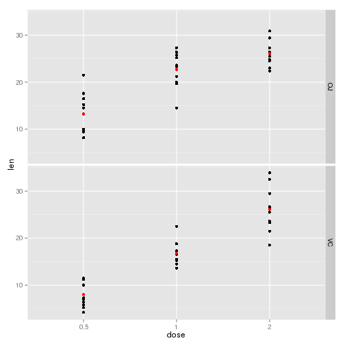

# Analysis of the ToothGrowth Data Setup

Now in the second portion of the class, we're going to analyze the ToothGrowth data in the R datasets package.

- Load the ToothGrowth data and perform some basic exploratory data analyses
- Provide a basic summary of the data.
- Use confidence intervals and/or hypothesis tests to compare tooth growth by supp and dose. (Only use the techniques from class, even if there's other approaches worth considering)
- State your conclusions and the assumptions needed for your conclusions.

Some criteria that you will be evaluated on

- Did you  perform an exploratory data analysis of at least a single plot or table highlighting basic features of the data?
- Did the student perform some relevant confidence intervals and/or tests?
- Were the results of the tests and/or intervals interpreted in the context of the problem correctly?
- Did the student describe the assumptions needed for their conclusions?


---
## Setup


```r
data(ToothGrowth)
```

## Summary of Data

The following was taken directly from the help page (`?ToothGrowth`)
for the data set.


```r
require(graphics)
coplot(len ~ dose | supp, data = ToothGrowth, panel = panel.smooth,
       xlab = "ToothGrowth data: length vs dose, given type of supplement")
```

 

Here we see that for the smaller dosages, `OJ` seems to perform better
than `VC`, whereas for the larger dosages they seem to perform about
equally. This analysis will examine exactly this.


```r
vc <- ToothGrowth[ToothGrowth$supp == "VC", c(1,3)]
vc$dose <- as.factor(vc$dose)
oj <- ToothGrowth[ToothGrowth$supp == "OJ", c(1,3)]
oj$dose <- as.factor(oj$dose)
summary(vc)
```

```
##       len         dose   
##  Min.   : 4.20   0.5:10  
##  1st Qu.:11.20   1  :10  
##  Median :16.50   2  :10  
##  Mean   :16.96           
##  3rd Qu.:23.10           
##  Max.   :33.90
```

```r
summary(oj)
```

```
##       len         dose   
##  Min.   : 8.20   0.5:10  
##  1st Qu.:15.53   1  :10  
##  Median :22.70   2  :10  
##  Mean   :20.66           
##  3rd Qu.:25.73           
##  Max.   :30.90
```

We see that the mean `len`th for diets supplemented with `OJ` is
larger than that of `VC`

## Analysis

Based on the information above, we would like to know if `OJ` really
is the better supplement for toothgrowth in guinea pigs.

\( H_0 = \) No, `OJ` does not perform better than `VC` as a supplement

\( H_A = \) Yes, `OJ` does perform better than `VC` as a supplement

Assumptions:

1. The distribution is nearly normal for the guinea pigs.
2. The observations are independent.
3. The guinea pigs represent less than 10% of the population.
4. The samples are independent

We will use _t-intervals_ for our tests.

Confidence interval of the difference between `OJ` and `VC`


```r
t.test(oj$len, vc$len, paired = FALSE, var.equal = TRUE)$conf
```

```
## [1] -0.1670064  7.5670064
## attr(,"conf.level")
## [1] 0.95
```

Confidence interval of the difference between `OJ` and `VC` at 0.5 mg/day


```r
t.test(oj[oj$dose == 0.5,]$len, vc[vc$dose == 0.5,]$len, paired = FALSE, var.equal = TRUE)$conf
```

```
## [1] 1.770262 8.729738
## attr(,"conf.level")
## [1] 0.95
```

Confidence interval of the difference between `OJ` and `VC` at 1 mg/day


```r
t.test(oj[oj$dose == 1,]$len, vc[vc$dose == 1,]$len, paired = FALSE, var.equal = TRUE)$conf
```

```
## [1] 2.840692 9.019308
## attr(,"conf.level")
## [1] 0.95
```

Confidence interval of the difference between `OJ` and `VC` at 2 mg/day


```r
t.test(oj[oj$dose == 2,]$len, vc[vc$dose == 2,]$len, paired = FALSE, var.equal = TRUE)$conf
```

```
## [1] -3.722999  3.562999
## attr(,"conf.level")
## [1] 0.95
```

## Conclusion
